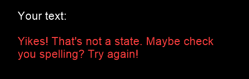

# State Paths

#### How well do you know your states?

**Author**: Harshita Pasham - [`hpasham2@illinois.edu`](mailto:hpasham2@illinois.edu)

##Dependencies

- [Visual Studio 2017](https://visualstudio.microsoft.com/)
- [`cmake`](https://cmake.org/)
- [`cinder`](https://libcinder.org/)
- [`nlohmann/json`](https://github.com/nlohmann/json)

####Windows

[Visual Studio 2017](https://visualstudio.microsoft.com/) on Microsoft Windows is required to build this project with CMake.

##Game

####Instructions

Once the project is run, this is the initial window that will appear:

Following the instructions on the window, type in the full name (no abbreviations/capitalization is not necessary) of a state that borders the current state and press `ENTER`.
In this case, the current state is `New Jersey` and I will type in `pennsylvania` as it borders the current state and press the `ENTER` key.

If the entered state is indeed a **bordering state and is spelled correctly**, the current state will be updated with the state that was entered as such:

If the state **does not border the current state**, this message will appear:

If the state is **spelled incorrectly**, this message will appear:

Once you **reach the final state**, this message will appear:

To **play again**, simply type `RESET` or `START OVER`, press the `ENTER` key, and the game will restart.
